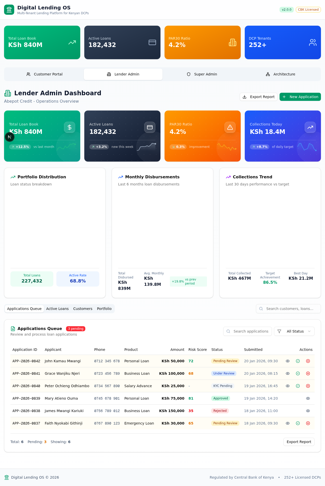

# Digital Lending OS - User Guide

<div align="center">

**Complete Guide for DCP Administrators and Loan Officers**

Version 2.0.0

[Getting Started](#getting-started) • [Dashboard](#understanding-the-dashboard) • [Customer Management](#customer-management) • [Loan Applications](#managing-loan-applications) • [Loans & Repayments](#loans--repayments) • [Reports](#reports--analytics)

</div>

---

## Table of Contents

1. [Introduction](#introduction)
2. [Getting Started](#getting-started)
3. [Understanding the Dashboard](#understanding-the-dashboard)
4. [Customer Management](#customer-management)
5. [Managing Loan Applications](#managing-loan-applications)
6. [Loans & Repayments](#loans--repayments)
7. [Reports & Analytics](#reports--analytics)
8. [User Roles & Permissions](#user-roles--permissions)
9. [Troubleshooting](#troubleshooting)
10. [Glossary](#glossary)

---

## Introduction

Welcome to **Digital Lending OS**! This guide will help you navigate and effectively use the platform to manage your digital credit operations.

### Who This Guide Is For

- **DCP Administrators**: Manage settings, users, and oversee operations
- **Loan Officers**: Process applications, manage customers, handle disbursements
- **Collection Officers**: Track repayments, follow up on arrears
- **Managers**: Review reports, monitor KPIs, make strategic decisions

### What You Can Do With This Platform

| Feature | Description |
|---------|-------------|
| Customer Onboarding | Register borrowers with full KYC data |
| Loan Processing | From application to disbursement |
| Credit Assessment | Evaluate borrower risk and affordability |
| Disbursements | Send funds via M-Pesa, Bank Transfer, PesaLink |
| Collections | Track payments and manage arrears |
| Reporting | Generate reports for management and CBK compliance |

---

## Getting Started

### System Requirements

- Modern web browser (Chrome, Firefox, Safari, Edge)
- Stable internet connection
- Login credentials provided by your administrator

### Logging In

1. Open your browser and navigate to your tenant's URL:
   ```
   https://digitallendingos.co.ke/[your-slug]
   ```
   
   For example, Abepot Credit would use:
   ```
   https://digitallendingos.co.ke/abepot
   ```

2. Enter your credentials:
   - **Email**: Your registered email address
   - **Password**: Your secure password

3. Click **Sign In**

> **First Time Login?** You'll be prompted to change your password and set up two-factor authentication (if enabled by your admin).

### Navigating the Interface

The main interface consists of:

```
┌─────────────────────────────────────────────────────────────┐
│  HEADER: Logo | Tenant Name | User Menu | Notifications     │
├──────────┬──────────────────────────────────────────────────┤
│          │                                                  │
│ SIDEBAR  │              MAIN CONTENT AREA                   │
│          │                                                  │
│ Dashboard│  ┌────────────────────────────────────────────┐  │
│ Customers│  │                                            │  │
│ Apps     │  │         Page Content                      │  │
│ Loans    │  │                                            │  │
│ Products │  │                                            │  │
│ Reports  │  │                                            │  │
│ Settings │  └────────────────────────────────────────────┘  │
│          │                                                  │
└──────────┴──────────────────────────────────────────────────┘
```

---

## Understanding the Dashboard

The dashboard is your command center, showing a real-time overview of your lending operations.



### Key Performance Indicators (KPIs)

#### Top Summary Cards

| Metric | Description | Why It Matters |
|--------|-------------|----------------|
| **Total Loan Book** | Sum of all active loan principals | Shows your total capital deployed |
| **Active Loans Count** | Number of currently active loans | Indicates operational volume |
| **PAR30 Ratio** | % of loans 30+ days in arrears | Key indicator of portfolio health |
| **Outstanding Balance** | Total amount owed by borrowers | Your receivables position |

#### Understanding PAR30

**PAR30 (Portfolio at Risk 30+ days)** is a critical metric for lenders:

```
PAR30 = (Loans with 30+ days arrears / Total Active Loans) × 100
```

| PAR30 Range | Health Status | Recommended Action |
|-------------|---------------|-------------------|
| 0% - 3% | 🟢 Excellent | Maintain current practices |
| 3% - 5% | 🟡 Good | Monitor closely |
| 5% - 10% | 🟠 Moderate Concern | Strengthen collections |
| 10%+ | 🔴 High Risk | Urgent review needed |

### Dashboard Sections

#### 1. Overview Section

Displays high-level metrics about your lending portfolio:

- **Total Loan Book Value**: KSh value of all active loans
- **Total Outstanding**: Amount yet to be collected
- **Total Interest Accrued**: Earned but not yet received interest
- **Total Repayable**: Principal + Interest + Fees due

#### 2. Loans Section

Quick view of loan status distribution:

| Status | Meaning |
|--------|---------|
| Active | Loans being repaid on schedule |
| In Arrears | Loans with missed payments |
| PAR30 | Loans 30+ days overdue |
| Defaulted | Loans written off as bad debt |
| Fully Paid | Completed loans |

#### 3. Applications Pipeline

Track applications through their lifecycle:

```
DRAFT → SUBMITTED → UNDER REVIEW → APPROVED → DISBURSED
                                    ↘
                                     REJECTED
```

#### 4. Collections Today

Real-time collection metrics:

- **Amount Collected**: Total KSh collected today
- **Number of Payments**: Payment transactions count
- **vs Target**: Progress toward daily target

#### 5. Recent Activity Feed

Latest actions in your system:

- New loan disbursements
- Application approvals/rejections
- Large repayments received
- Status changes

### Refreshing Data

Dashboard data refreshes automatically every 60 seconds. To force a refresh:
- Press **F5** or **Ctrl+R** (Windows) / **Cmd+R** (Mac)
- Click the refresh icon (🔄) if available

---

## Customer Management

### Registering a New Customer

1. Navigate to **Customers** from the sidebar menu
2. Click **+ Add Customer** button
3. Fill in the required information:

#### Required Fields

| Field | Description | Example |
|-------|-------------|---------|
| First Name | Customer's first name | Wanjiku |
| Last Name | Customer's last name | Mwangi |
| Phone | Primary contact (M-Pesa registered) | +254712345678 |

#### Recommended Additional Fields

| Field | Description | Importance |
|-------|-------------|------------|
| Email Address | For notifications | Medium |
| National ID | KYC verification | **High** |
| Date of Birth | Age verification | Medium |
| Employment Status | Income assessment | **High** |
| Employer Name | Employment verification | Medium |
| Monthly Income | Affordability check | **High** |
| County/Location | Geographic risk | Low |
| M-Pesa Phone | Disbursement phone | **High** |

4. Click **Save Customer**

### Viewing Customer Details

Click any customer name to see their complete profile:

```
┌─────────────────────────────────────────────────────────┐
│  CUSTOMER PROFILE: Wanjiku Mwangi                       │
├─────────────────────────────────────────────────────────┤
│                                                         │
│  Personal Info          │  Contact                     │
│  • ID: 12345678        │  • +254712345678             │
│  • DOB: 15-Jun-1990    │  • wanjiku@email.com         │
│  • Gender: Female      │  • County: Nairobi           │
│                         │                              │
│  Credit Profile         │  Employment                  │
│  • Score: 720          │  • Employed                  │
│  • CRB: CLEAN          │  • Acme Ltd                  │
│  • Risk: LOW           │  • KSh 85,000/month          │
│                         │                              │
├─────────────────────────────────────────────────────────┤
│  LOAN SUMMARY                                           │
│  • Total Borrowed: KSh 150,000                          │
│  • Total Repaid: KSh 135,000                            │
│  • Outstanding: KSh 15,000                              │
│  • Active Loans: 1                                      │
└─────────────────────────────────────────────────────────┘
```

### Customer Tabs

| Tab | Contents |
|-----|----------|
| **Profile** | Personal details, contact info |
| **Loans** | Current and historical loans |
| **Applications** | All loan applications |
| **Repayments** | Payment history |
| **Documents** | Uploaded KYC documents |
| **Notes** | Internal notes/comments |

### Searching for Customers

Use the search bar to find customers by:

- **Name**: First or last name
- **Phone Number**: Full or partial number
- **National ID**: ID number
- **Email**: Email address

### Updating Customer Information

1. Go to customer profile
2. Click **Edit** button
3. Update the required fields
4. Click **Save Changes**

> **Note:** Changes are logged in the audit trail for compliance.

### Customer Status Management

Customers can have these statuses:

| Status | Description | When to Use |
|--------|-------------|-------------|
| ACTIVE | Normal operating status | Default for all customers |
| INACTIVE | Temporarily disabled | Customer requested pause |
| BLACKLISTED | Blocked from new loans | Fraud or severe default |
| FROZEN | Under investigation | Suspicious activity |
| PENDING_VERIFICATION | Awaiting KYC completion | New registration |
| REJECTED | Application denied | Didn't meet criteria |

To change status:
1. Open customer profile
2. Click **Status** dropdown
3. Select new status
4. Add reason (required for some changes)
5. Confirm

---

## Managing Loan Applications

### The Application Workflow

Every loan application goes through these stages:

```
┌─────────────┐    ┌──────────────┐    ┌────────────────┐
│ SUBMISSION  │───▶│ KYC VERIFY   │───▶│ CREDIT ASSESS   │
│             │    │              │    │                │
└─────────────┘    └──────────────┘    └────────────────┘
                                               │
                                               ▼
┌─────────────┐    ┌──────────────┐    ┌────────────────┐
│  DISBURSED  │◀───│ DOCUMENT     │◀───│ MANUAL REVIEW  │
│             │    │ SIGNING      │    │                │
└─────────────┘    └──────────────┘    └────────────────┘
```

### Submitting a New Application

1. Navigate to **Applications** > **New Application**
2. Select or create the customer
3. Choose the appropriate loan product
4. Enter loan details:

#### Application Form Fields

| Field | Description | Validation |
|-------|-------------|------------|
| Customer | Borrower selection | Required |
| Product | Loan product type | Required |
| Requested Amount | How much they want | Within product limits |
| Term Days | Loan duration | Within product limits |
| Purpose | Reason for loan | Optional but recommended |

5. Click **Submit Application**

### Reviewing Applications

Access the Applications list to see all pending items:

#### Application List Columns

| Column | Description |
|--------|-------------|
| Reference | Unique application ID |
| Customer | Borrower name and phone |
| Product | Loan product selected |
| Amount | Requested amount |
| Status | Current workflow stage |
| Date | When submitted |
| Priority | Risk-based priority flag |

#### Filtering Applications

Filter by:
- **Status**: DRAFT, SUBMITTED, UNDER_REVIEW, etc.
- **Date Range**: Submission date range
- **Product Type**: Filter by loan category
- **Amount Range**: Min/max amounts
- **Customer**: Specific borrower

### Approving an Application

1. Open the application details
2. Review all information:
   - ✅ Customer profile completeness
   - ✅ KYC documents verified
   - ✅ Credit score acceptable
   - ✅ Affordability confirmed
   - ✅ Purpose is legitimate
   
3. Check the application checklist:
   ```
   ☐ Identity Verified
   ☐ Income Confirmed
   ☐ Affordability Check Passed
   ☐ CRB Status Clean
   ☐ Documents Complete
   ☐ Purpose Validated
   ```

4. Click **Approve** button
5. Enter approval details:
   - **Approved Amount**: May differ from requested
   - **Decision Notes**: Reason for approval
6. Confirm approval

### Rejecting an Application

If an application doesn't meet criteria:

1. Open the application
2. Click **Reject** button
3. Select rejection reason:
   - Insufficient income
   - Poor credit history
   - Incomplete documentation
   - High existing debt
   - Other (specify)
4. Add detailed explanation
5. Confirm rejection

> **Best Practice:** Always provide clear reasons to help customers understand and improve future applications.

### Application Status Tracker

Visual representation of where an application is in the workflow:

```
✅ SUBMITTED     ✅ KYC VERIFIED     ⏳ CREDIT ASSESSMENT
                                      ○ MANUAL REVIEW
                                      ○ MANAGER APPROVAL
                                      ○ DISBURSEMENT
```

---

## Loans & Repayments

### Creating a Loan from Approved Application

Once approved, applications move to disbursement:

1. Go to **Applications** > **Approved**
2. Select the application
3. Click **Create Loan**
4. Verify/enter disbursement details:

#### Disbursement Form

| Field | Description |
|-------|-------------|
| Principal | Approved amount |
| Interest Rate | As per product |
| Interest Type | FLAT_RATE, REDUCING_BALANCE, AMORTIZED |
| Term Days | Loan duration |
| Processing Fee | One-time fee |
| Insurance Fee | Insurance charge |
| Disbursement Method | MPESA, BANK_TRANSFER, PESALINK |
| Account/Phone | Recipient details |

5. Review generated repayment schedule
6. Click **Disburse Loan**

### Understanding the Repayment Schedule

Each loan has a repayment schedule showing all installments:

| Installment | Due Date | Principal | Interest | Fees | Total | Status |
|-------------|----------|-----------|----------|------|-------|--------|
| 1 | 15-Feb-2026 | 16,667 | 354 | 250 | 17,271 | PAID |
| 2 | 15-Mar-2026 | 16,667 | 354 | 250 | 17,271 | PENDING |
| 3 | 15-Apr-2026 | 16,666 | 354 | 250 | 17,270 | SCHEDULED |

### Recording Manual Repayments

When a customer makes a payment outside automatic systems:

1. Navigate to **Loans** > select the loan
2. Click **Record Repayment**
3. Enter payment details:

#### Repayment Entry Form

| Field | Description |
|-------|-------------|
| Amount Received | Total amount paid |
| Payment Method | MPESA, CASH, BANK_TRANSFER, etc. |
| Reference Number | Transaction reference (M-Pesa code, etc.) |
| Payment Date | When payment was made |
| Notes | Any additional info |

4. System auto-allocates to:
   - Outstanding principal
   - Due interest
   - Any fees/penalties
5. Confirm recording

### Tracking Arrears

The system automatically tracks overdue payments:

#### Arrears Categories

| Category | Days Overdue | Action Required |
|----------|--------------|-----------------|
| CURRENT | 0 days | Normal monitoring |
| DAYS_1_7 | 1-7 days | SMS reminder |
| DAYS_8_30 | 8-30 days | Phone call |
| DAYS_31_60 | 31-60 days | Formal notice |
| DAYS_61_90 | 61-90 days | Escalation to collections |
| DAYS_91_PLUS | 91+ days | Legal action consideration |

### Loan Actions Menu

Available actions per loan:

| Action | Description | When to Use |
|--------|-------------|-------------|
| View Details | See full loan info | Always available |
| Record Payment | Log manual payment | Cash/walk-in payments |
| Update Status | Change loan state | Status corrections |
| Assign Collector | Set collection officer | For follow-up |
| Add Collection Note | Document interaction | Every customer contact |
| Restructure Terms | Modify repayment plan | Hardship cases |
| Write Off | Mark as bad debt | Recovery exhausted |
| Close Loan | Finalize completed loan | Fully paid |

### Disbursement Methods

| Method | Processing Time | Best For |
|--------|-----------------|----------|
| **M-Pesa** | Instant (seconds) | Most common, small-medium amounts |
| **Bank Transfer** | 1-3 business days | Large amounts, corporate clients |
| **PesaLink** | Instant | Inter-bank transfers |
| **Cash** | Immediate | Branch disbursements |
| **Check** | 1-3 business days | Special cases only |

---

## Reports & Analytics

### Available Reports

Navigate to **Reports** from the sidebar.

#### Portfolio Reports

| Report | Description | Frequency |
|--------|-------------|-----------|
| **Portfolio Summary** | Overall loan book health | Daily |
| **Aging Report** | Loans by days past due | Weekly |
| **PAR Analysis** | Portfolio at Risk breakdown | Weekly |
| **Loan Book Value** | Total outstanding by product | Monthly |

#### Operational Reports

| Report | Description | Frequency |
|--------|-------------|-----------|
| **Applications Pipeline** | Apps by status | Daily |
| **Disbursement Report** | Funds disbursed | Daily/Monthly |
| **Collections Report** | Payments received | Daily |
| **Arrears Report** | Overdue loans | Weekly |
| **Collector Performance** | Team productivity | Monthly |

#### Customer Reports

| Report | Description | Frequency |
|--------|-------------|-----------|
| **Customer List** | All registered borrowers | As needed |
| **New Customers** | Recently registered | Weekly |
| **High-Value Customers** | Top borrowers | Monthly |
| **Blacklisted Customers** | Blocked borrowers | As needed |

### Generating Reports

1. Go to **Reports**
2. Select report type
3. Configure filters:
   - **Date Range**: Report period
   - **Product**: Specific products (optional)
   - **Officer**: Specific user (optional)
   - **Status**: Filter by status
4. Click **Generate**
5. View online or export:
   - **PDF**: For printing/sharing
   - **Excel**: For further analysis
   - **CSV**: For system imports

### Understanding Key Metrics

#### Portfolio Health Metrics

| Metric | Formula | Target |
|--------|---------|--------|
| **PAR30** | (30+ day arrears / Active Loans) × 100 | < 5% |
| **NPL Ratio** | Non-performing loans / Total loans | < 10% |
| **Collection Rate** | Collected / Due × 100 | > 95% |
| **Average Loan Size** | Total loan book / # loans | Varies |
| **Cost of Funds** | Interest expense / Avg loans | Monitor |

### Dashboard Charts

The dashboard includes visual analytics:

1. **Loan Status Pie Chart**: Distribution of loan statuses
2. **Monthly Disbursements Bar Chart**: Disbursement trends
3. **Collections Trend Line**: Collection performance over time
4. **Product Mix Chart**: Loans by product type
5. **Arrears Aging Chart**: Breakdown by days overdue

---

## User Roles & Permissions

### Role Hierarchy

```
┌─────────────────────────────────┐
│       SUPER_ADMIN               │  Platform-level access
│   (Digital Lending OS Staff)    │
└──────────────┬──────────────────┘
               │
┌──────────────▼──────────────────┐
│       TENANT_ADMIN              │  Full tenant control
│   (DCP Owner/Manager)           │
└──────────────┬──────────────────┘
               │
┌──────────────▼──────────────────┐
│         MANAGER                 │  Operations oversight
│   (Branch Manager)              │
└──────────────┬──────────────────┘
               │
    ┌──────────┴──────────┐
    │                     │
┌───▼──────┐        ┌────▼─────┐
│  STAFF   │        │  AGENT   │  Day-to-day ops
│(Loan Off.)│        │(Field)   │
└──────────┘        └──────────┘
                       │
               ┌───────▼───────┐
               │    VIEWER     │  Read-only access
               │ (Auditor)     │
               └───────────────┘
```

### Permission Matrix

| Feature | SUPER_ADMIN | TENANT_ADMIN | MANAGER | STAFF | AGENT | VIEWER |
|---------|:-----------:|:------------:|:-------:|:-----:|:-----:|:------:|
| View Dashboard | ✅ | ✅ | ✅ | ✅ | ✅ | ✅ |
| Manage Tenants | ✅ | Own only | ❌ | ❌ | ❌ | ❌ |
| Manage Users | ✅ | ✅ | ❌ | ❌ | ❌ | ❌ |
| Create Customers | ✅ | ✅ | ✅ | ✅ | ✅ | ❌ |
| Edit Customers | ✅ | ✅ | ✅ | ✅ | Limited | ❌ |
| Create Applications | ✅ | ✅ | ✅ | ✅ | ✅ | ❌ |
| Approve/Reject | ✅ | ✅ | ✅ | ✅ | ❌ | ❌ |
| Disburse Loans | ✅ | ✅ | ✅ | ✅ | ❌ | ❌ |
| Record Payments | ✅ | ✅ | ✅ | ✅ | ✅ | ❌ |
| Write Off Loans | ✅ | ✅ | ✅ | ❌ | ❌ | ❌ |
| View Reports | ✅ | ✅ | ✅ | ✅ | ✅ | ✅ |
| Export Data | ✅ | ✅ | ✅ | Limited | ❌ | ✅ |
| Manage Products | ✅ | ✅ | ❌ | ❌ | ❌ | ❌ |
| System Config | ✅ | Limited | ❌ | ❌ | ❌ | ❌ |

---

## Troubleshooting

### Common Issues & Solutions

#### Login Problems

| Issue | Solution |
|-------|----------|
| Invalid credentials | Check email/password, ensure Caps Lock off |
| Account locked | Wait 15 minutes or contact admin |
| "Tenant not found" | Verify URL slug is correct |
| Session expired | Log in again |

#### Application Issues

| Issue | Solution |
|-------|----------|
| Can't submit app | Ensure all required fields completed |
| Product not visible | Check if product is active for your tenant |
| Amount rejected | Verify within product min/max limits |
| Customer not found | Search by phone or create new customer |

#### Loan Issues

| Issue | Solution |
|-------|----------|
| Can't disburse | Check application is approved first |
| Schedule incorrect | Contact support to regenerate |
| Payment not reflecting | Wait 5 mins for M-Pesa sync |
| Wrong status update | Use audit log to track changes |

#### Performance Issues

| Issue | Solution |
|-------|----------|
| Slow loading | Clear browser cache, check internet |
| Reports timing out | Reduce date range, try off-peak hours |
| Dashboard not refreshing | Hard refresh (Ctrl+F5) |

### Getting Help

#### Self-Service Resources

- 📖 This User Guide
- 🔗 [API Documentation](API.md) - For technical queries
- 💡 Tooltips throughout the interface
- ❓ Help icons (?) on forms

#### Contacting Support

| Channel | When to Use | Response Time |
|---------|-------------|---------------|
| In-app Chat | Quick questions | < 1 hour |
| Email: support@... | Detailed issues | < 24 hours |
| Phone: Hotline | Urgent issues | Immediate |

#### Information to Provide When Contacting Support

For faster resolution, include:

1. **Your Tenant Name**
2. **Your User ID/Email**
3. **Description of the issue**
4. **Steps to reproduce** (if applicable)
5. **Screenshots** (if visual issue)
6. **Error messages** (exact text)
7. **When the issue started**

---

## Glossary

| Term | Definition |
|------|------------|
| **DCP** | Digital Credit Provider - licensed lender |
| **CBK** | Central Bank of Kenya - regulator |
| **CRB** | Credit Reference Bureau - credit history agency |
| **KYC** | Know Your Customer - identity verification |
| **PAR30** | Portfolio at Risk (30+ days overdue) |
| **NPL** | Non-Performing Loan - defaulted loan |
| **M-Pesa** | Safaricom mobile money service |
| **PesaLink** | Inter-bank instant transfer system |
| **Principal** | Original loan amount borrowed |
| **Interest** | Cost of borrowing |
| **Arrears** | Overdue/unpaid amounts |
| **Disbursement** | Sending funds to borrower |
| **Tenancy** | Multi-organization data isolation |
| **Workflow** | Sequence of steps for processing |
| **Audit Trail** | Log of all system actions |

---

## Keyboard Shortcuts

| Shortcut | Action |
|----------|--------|
| `Alt + D` | Go to Dashboard |
| `Alt + C` | Go to Customers |
| `Alt + A` | Go to Applications |
| `Alt + L` | Go to Loans |
| `Alt + R` | Go to Reports |
| `Ctrl + K` | Global search |
| `Esc` | Close modal/dialog |
| `Enter` | Submit form |

---

## Best Practices

### For Loan Officers

1. **Complete KYC First**: Never approve without verified identity
2. **Check CRB Always**: Even for repeat customers
3. **Verify Affordability**: Use income documentation
4. **Document Everything**: Keep decision notes clear
5. **Follow Up Promptly**: Don't let applications sit pending

### For Collection Officers

1. **Contact Early**: Reach out before due date
2. **Be Professional**: Maintain good relationships
3. **Document Calls**: Log every conversation
4. **Offer Solutions**: Restructure when possible
5. **Know the Rules**: Follow CBK guidelines

### For Managers

1. **Review Daily**: Check dashboard every morning
2. **Monitor PAR30**: Watch this key metric
3. **Coach Staff**: Regular training sessions
4. **Analyze Trends**: Weekly report review
5. **Plan Ahead**: Forecast cash flow needs

---

<div align="center">

**Need technical help?** See the [Developer Guide](DEVELOPER.md)

**Questions about configuration?** Check [Sample Configurations](SAMPLE_CONFIGURATIONS.md)

</div>
